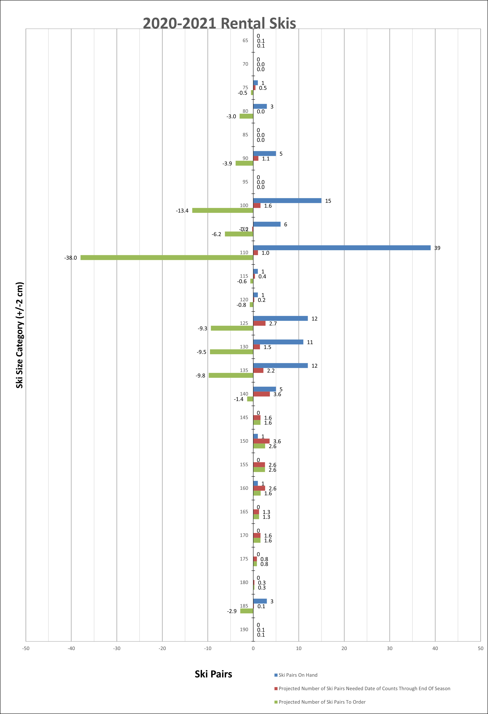

# **Play It Again Sports Lynnwood 2020-2021 Rental Skis Mid-season Report**

## Kevin Baron
## baronk2@uw.edu
## October 1, 2022

### *Task 1*
#### First, in your own words, you should include a brief paragraph that summarizes what you did to find your data visualization and you should explain why you selected the visualization. In addition, you should include a link to your visualization. (About 100 words.)

I found my data visualization by looking through my own records on the laptop I'm currently working on for this assignment. Past work-emphasized work-life balance led to working on data projects largely on my own time, either at Play It Again Sports before or after operating hours, or at home on this laptop and my desktop computer. The visualization is from a graph produced in an Excel spreadsheet titled "Rental\_Usage,\_Projection,\_2022,01,21,\_19,11.xlsx" on a sheet titled "Skis." I selected this visualization because it is a project I'm still working on and am still passionate about, and because this visualization is one of the first, or, I believe, the _very first_ one I actually collected and organized the data enough to produce for the store owners. There is no publicly available link to this private data visualization. Instead, for the purpose of including a hyperlink for the requirements of this assignment, here is a link to the Play It Again Sports website: [Lynnwood Play It Again Sports](https://www.playitagainsports.com/locations/lynnwood-wa).

### *Task 2*
#### Second, your report should include a description of the visualization; that is, what specifically does the data visualization show? (About 100 words.)

The visualization breaks the rental skis in Play It Again's inventory into 5 cm size categories, centered at 5 cm increments (e.g. [128 cm, 129 cm, 130 cm, 131 cm, 132 cm], [133 cm, 134 cm, 135 cm, 136 cm, 137 cm], and shows three statistics for each size category:

* (Blue) The number of ski pairs on hand in the back of the store, which could potentially be rented out to customers. I believe that this did not count the skis currently rented out for daily and weekly rentals, although it may have counted these. Data on whether those were included was not stored, but was remembered at the time for reporting to the business owners.

* (Red) The number of ski pairs we were projected to need to meet rental demand for the rest of the 2020-2021 winter season after the February 15, 2021 inventory count date. The projection was created by cross-referencing previous seasons' monthly net rental sales data and estimated inventory counts for those seasons, before equipment had been logged and inventoried, compared to the current season's trends

* (Green) The number of ski pairs to order, calculated as "[Pairs Needed] - [Pairs On Hand]." Negative values correspond to surplus, which could be sold off to add to the pool of money available to order other sizes. This statistic is somewhat redundant, but it is the main focus of the graphic. The other two statistics are there as supporting information, to put the to-order quantities into perspective and context.

### *Task 3*
#### Third, write short responses after each of these five headings. **Please note**: You should replace the `xxx (...)` with your own written response.
#### _I've included all six headings mentioned earlier in the instructions.md document, including "Power."_

#### 1. **Who**: Who or what institution produced the visualization?

I produced the visualization for Play It Again Sports - Lynnwood.

#### 2. **Date**: When was it produced?

The graph is saved as an image from an Excel file timestamped with its file name at 7:11 pm on January 21st, 2022. However, it is from before that time, saved through multiple versions of the file, dating back to an inventory count on February 15th, 2021, which is near the end of the winter season.

#### 3. **Stakeholders**: Who is the audience for the visualization? And, who might be impacted, either directly or indirectly, by the visualization?

The main intended audience for the visualization was John Florendo and Julie Florendo, the co-owners of Play It Again Sports. It is in their interest to have enough skis, among other types of rental equipment, to last through a given winter season to meet their customers' demand and maximize profit. Another stakeholder group is the customer base, who may or may not be able to secure their proper sizing for rental equipment. Another one is the employees at Play It Again, who are responsible with finding, tuning, repairing, and renting out the rental equipment and who are the primary contact point for customers' frustrations when we do not have equipment in their sizing or when rental turnaround times take too long because of extra processing time to turn new or used skis from the retail floor or from scrap piles into rentable skis.

#### 4. **Interests**: What values, goals, or interests are at stake with the visualization?

The value of meeting customer demand for rental equipment and the goal of maximizing profit in the rental department, with the interest of reducing stress for employees are all at stake with the interpretation and actionabilitiy of the visualization.

#### 5. **Key facts**: What can be learned from the visualization?

Play It Again Sports has a surplus of skis around the 100 cm and 110 cm size range, as can be seen from the large disparity between skis pairs on hand (shown by a blue bar for a given size category or size bin) and projected ski pairs needed for the rest of the season (red), and re-emphasized by the green bar representing the number of ski pairs to order to meet the need. For those two small ski sizes, the negative values in the to-order variable represent ski pairs that could be removed from the rental inventory, added to the sales inventory as used items, and sold off to add to cashflow available for purchasing skis and other equipment in needed sizes.

While there is a surplus in those sizes, the more important reason for the graphic is to highlight the sizes in which there is a dearth, since those sizes are most commonly rented as season and daily rentals throughout a day, week, month, and entire season. Those sizes are where the scrambling in the back always happens, season after season. That's why I want to help John and Julie better understand their data. From the visualization, it can be seen that we would need (x2)-(x3) pairs of each of the 145 cm - 170 cm size ranges.

#### 6. **Power**: What issues, if any, are related to power are reflected in the data visualization?

No matter how much I stress the importance of ordering in new equipment to supplement our aging rental fleet, I do not have budgeting or purchasing power in the store. At the time I made this visualization, the first of a number of seasons' worth of projections by now, my position was as Sales Associate, with the emphasis of being a shop worker and rental expert. Now I am the Lead Ski Technician. Because of my ongoing efforts to provide datafication to our rental endeavors, I have been offered management positions, but because of the lack of communication, toxicity, and incoherent planning I've had a window into among Play It Again's management team over the years, I've politely declined these offers, opting for a less stressful and less strapped-for-time-and-resources position where I can continue to focus on my passion, the data collection, analysis, and visualization. I understand that while John and Julie would promise that the increased power that would come along with a management position would mean I could participate in the top-level decision making, that is **_false_** and they would be unintentionally lying to me. Even when provided the necessary data to make good business decisions for the rental department, they consistently make poor decisions. I wouldn't want to associate myself with those decisions in a professional sense, since I can't justify them myself based on the clear data.

### *Task 4*
#### Fourth, and finally, conclude your report with a brief reflection, titled, "Data Feminism: What I Learned?" (About 120 words). In this section, first, give a definition of data feminism from D'Ignazio & Klein (2020). Include the page number of the definition. Second, given this definition and your reading, briefly discuss one or two issues related your chosen data visualization.

#### Data Feminism: What I Learned

There are no page numbers in the free MIT Press version of the book available online, but Christine Darden's concept, what D'Ignazio and Klein call 'data feminism' is defined in "Data Feminism"'s Introduction, in paragraph 9 of the subsection "What Is Data Feminism." They define it as

>...A way of thinking about data, both their uses and their limits, that is informed by direct experience, by a commitment to action, and by intersectional feminist thought.

My data visualization represents my personal commitment to action, and the situation of why the visualization is needed is representative of the store owner's non-commitment to action. Year after year, they say they want to add to the rental fleet and sell off old skis that are aging, but year after year, they fail to take action toward this goal.

One important concept of the data feminism framework is "Show Your Work." This data visualization fails to show the work of how the projected needs are created, as well as whether on-hand ski pairs counts the skis that were currently rented out as daily and weekly rentals. Showing this work was sacrificed at the time for the sake of urgency in delivering the report to the store owners before it was too late for the actionable takeaways to be in fact actionable. :confused:
